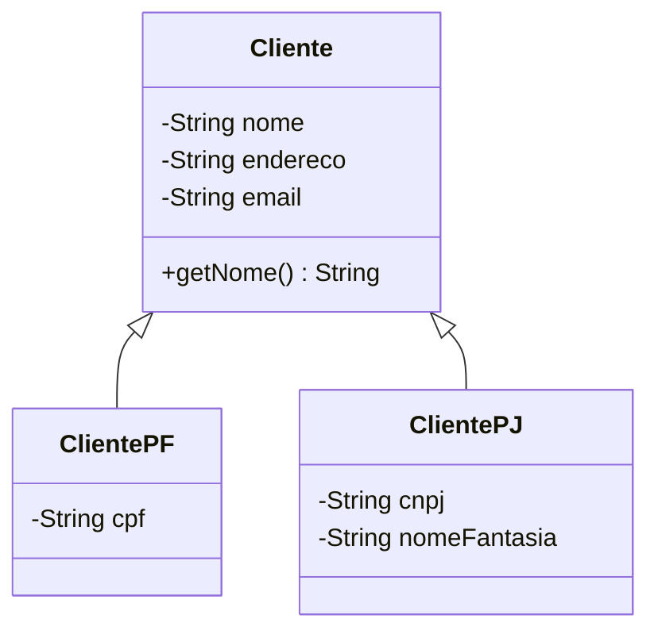

```mermaid
classDiagram
class Cliente{
    -String nome
    -String endereco
    -String email
    +getNome() String
}
class ClientePF{
    -String cpf
}
class ClientePJ{
    -String cnpj
    -String nomeFantasia
}

Cliente <|-- ClientePF
Cliente <|-- ClientePJ
```
