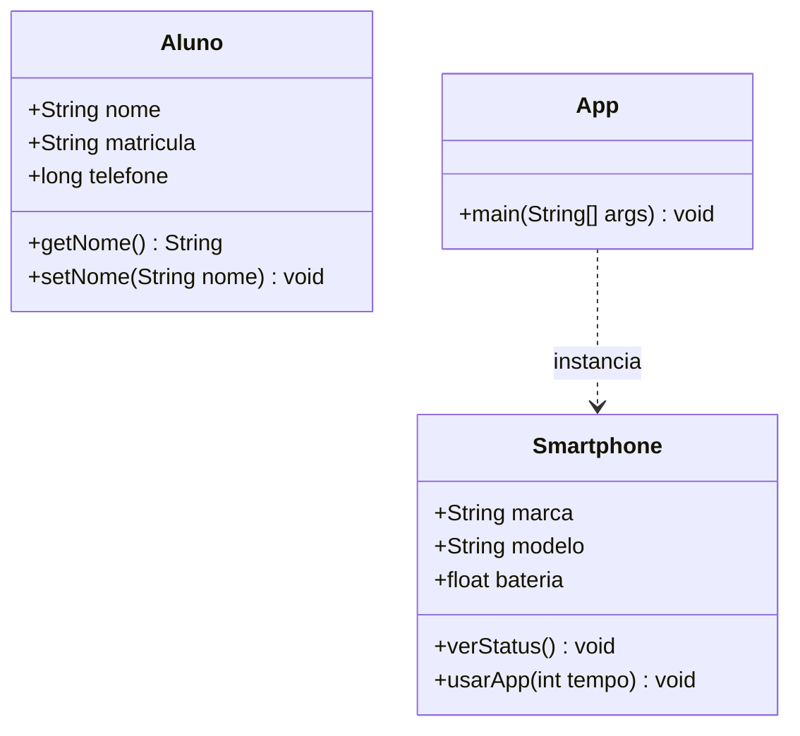
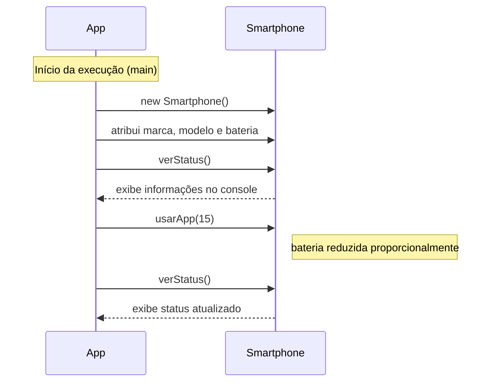

# Diagramas de Classes e Sequência

Abaixo estão as representações das classes `Aluno`, `Smartphone` e a lógica de execução presente em `App`.

## Diagrama de Classes

Este diagrama apresenta as classes e seus membros (atributos e métodos).

## Diagrama de Sequência

Este diagrama mostra o fluxo de execução definido no método `main` da classe `App`.

